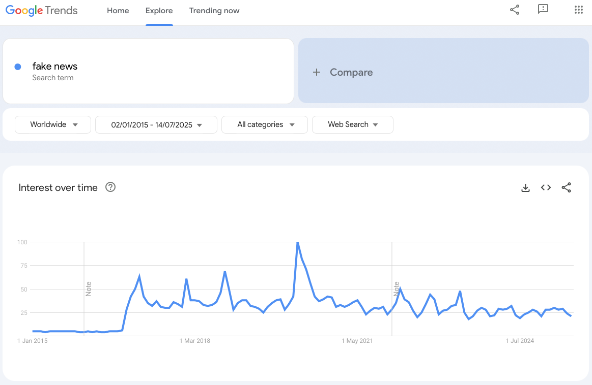

# Title of your blog post (should be both catchy and informative)

## Potential sub-heading (not required)

The text of your blog post should be informative, precise, and evidence-based, but also fun to read. You can add discussion and personal judgment, but always be clear which statements are based on scientific evidence and which are your opinion or beliefs.

Use paragraphs, created by empty lines, to structure your post. As discussed, you should also include an informative figure or table. See the link below for how to do that. Assume that the file containing the figure is located in the same folder as your blog post.

## Another sub-heading (also not required, but if you have one you need at least two)

In your text, you can refer to academic references either in text, like: Allcott and Gentzkow (2017) discuss the role of social media in spreading disinformation related to the 2016 U.S. election. Alternatively, you can provide references in brackets (Allcott and Gentzkow, 2017).

If you want to refer to non-academic content, you can include [direct links](https://www.nytimes.com/spotlight/misinformation) in the text.

After the main text of your blog post, you need to provide all references that you have used. Please use the format below and always provide the DOI URL and reference for the most recent published versions.

[Allcott, Hunt, and Matthew Gentzkow (2017): Social Media and Fake News in the 2016 Election. Journal of Economic Perspectives, Volume 31, Issue 2, Pages 211–236.](https://doi.org/10.1257/jep.31.2.211)
